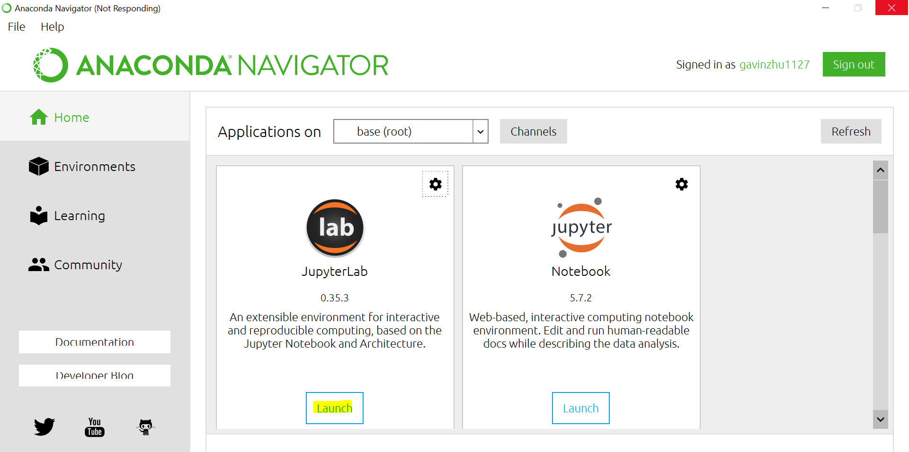
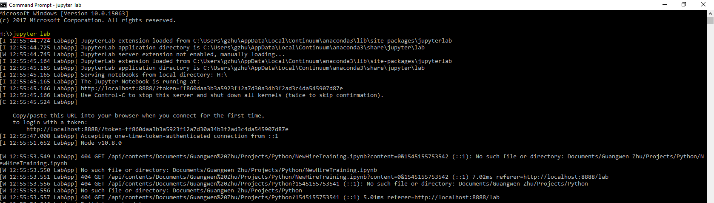

# Data-Science-using-Python

## Content
The repo includes a Jupyterlab notebook for explaining the baisc syntac of pything for data mugging, data visulization and machine learning processing including import data, feature engineering, feature selection, compare different algorithm, model interpretation and model implementation 

* Data Structure: Strings, Lists, Dictionaries and Tuples
- String
- List
- Dictionary
- Tuple
* Loops and Conditions
- Loop Through List
- Loop Through Dictionary
- Condition
* Array (using Numpy)
- Create Numpy Array
- Universal Function
- Search Value in Array
- Array Attributes
- Multi Dimensional Arrays
- Sort Array
* DataFrame (using Pandas)
- Import and Understand Data
- Different Choices for Indexing
- Fill Missing
- Feature Engineering
- Feature Encoding
* Visulization (using Seaborn/Plotly)
- Non Interactive Plot (Seaborn)
- Interactive Plot (Plotly)
* Machine Learning (using Sklearn)
- Split Data For Machine Learning
- Feature Selection
- Decision Tree
- Random Forest with Standard Grid Search
- GBM with Random Search
- Model Interpretation
- Model Implementation
* Useful Links

## Install Anaconda
1. download Anaconda from [link](https://www.anaconda.com/download/) and choose Python 3 version
2. install the tool and select "Add Anaconda to my PATH environment variable"

    
3. open command window to run the following command in order to install a few more python packages
    - *conda install -c anaconda seaborn* 
    - *conda install -c plotly plotly*
    - *conda install -c conda-forge nodejs*
    - *conda install python-graphviz* 
4. run the following command to install a few more Jupyterlab extension
    - *jupyter labextension install @jupyterlab/toc*
    - *jupyter labextension install @jupyterlab/plotly-extension*   
5. after install you can click Anaconda Navigator to launch Jupyterlab

    

    or use command window to launch Jupyterlab by entering "jupyter lab"

    

6. download the .ipynb file and open it with Jupyterlab
